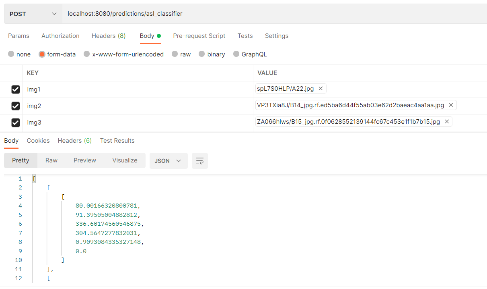

# ASL to Text


To access our solution, please open the [Streamlit](https://github.com/shawnpaul123/torch-serve/tree/master/Streamlit) folder for further instructions. 

# Introduction

This project uses Machine Learning to caption videos of people communicating in ASL. The product is a web interface that users can interact with by uploading videos and receiving labelled videos as a result. It can be used by non ASL users to translate ASL. It is also our team's submission to the Pytorch Annual Hackathon.

# Architecture

### Machine Learning
- Our model was trained using Pytorch using images in our [data/test](https://github.com/chandr-971/torch-serve/tree/data/test) folder. 
- For training, we used the public dataset 'American Sign Language Letters Dataset', which we obtained from roboflow.com.
- This dataset was created and augmented by David Lee.
- The completed model was then served using torch-serve and containerized in a docker container. (See Dockerfile)

### Front End
- Our team developed the front end on Streamlit. It receives videos from the user, converts them to frames and sends them to a blob storage in Microsoft Azure.
- It then sends a HTTP request to the Backend to receive the results of the Machine Learning model. 

### Backend
- A logic app on Microsoft Azure was used to interact with the docker container deployed on Azure Container Instances. It sends images from the blob storage to the container and receives a result.
- The result from the Container is then sent to the front end upon receiving the HTTP trigger.

# Appendix

## Yolov5 running on TorchServe

This is a Dockerfile to run TorchServe for Yolov5 object detection model. 
(TorchServe is a flexible and easy to use tool for serving deep learning models exported from PyTorch).

## Setting up the Docker image

* Build the Torch Serve image locally. More info [here](https://github.com/pytorch/serve/tree/master/docker)
 
* After training the Yolov5 model on COLAB, move the `best.pt` to the resources folder.

* Modify `index_to_name.json` to include any additional classes if needed.

* Modifying `batch_size` and `image_size` can be done:
    * In the `Dockerfile`: 
        ```bash
        RUN python /home/model-server/resources/yolov5/models/export.py --weights /home/model-server/resources/best.pt --img 416 --batch 16
        ```
    
    * In `torchserve_handler.py`: 
        ```python
        def __init__(self):
            super().__init__()
            self._context = None
            self.initialized = False
            self.batch_size = 16
            self.img_size = 416
        ```

* The docker image is ready to be built and used:
    ```bash
    docker build . -t your_tag:your_version
    docker run your_tag:your_version
    ```

## Getting predictions

Once the Docker image is running, you can send POST requests to: `localhost:8080/predictions/asl_classifier`.

[Here](https://pytorch.org/serve/inference_api.html#inference-api) is a list of all available inference APIs we can use against the server (health ping, predictions, metrics, etc.).

The handler in this project expect the inputs images to be sent via a Multipart form with a key:value form having in the keys the strings `img[index]` and in the values, the bytes of each images.

Example:
-------
For a batch_size of 5, we would have the following in our Multipart form request:

```
"img1": [bytes_of_the_1st_image],
"img2": [bytes_of_the_2st_image],
"img3": [bytes_of_the_3st_image],
"img4": [bytes_of_the_4st_image],
"img5": [bytes_of_the_5st_image],
```

The returned json of the request contain a single list. Each i-th element of this list represent the i-th image detection results (represented by:
`(x1, y1, x2, y2, conf, cls)`)

If there is less input images than the batch size, the rest of the inference batch will be padded with zeros inputs.

I inferenced 5 images using Postman. The JSON output is stored in `response.txt`.



## Notes:

* The Yolov5 folder in resources is just here to export the model to a TorchScript version.
(It could be optimized to keep only the `export.py` file but I could break stuff given code dependencies)

* If you want to run with a GPU, change the line 'cpu' to 'cuda:0' in the `export.py` file of Yolov5
